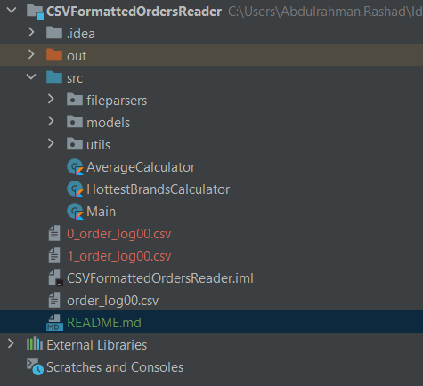
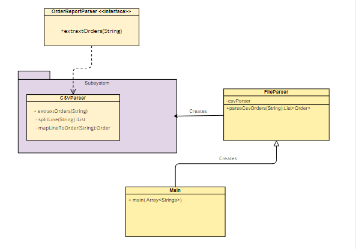

# Simple app using kotlin reads .csv files containing orders details 

To-do List app using with Firebase, using RiverPod as state management and dependency injection.

### To run the application make sure you have intelij installed with java jdk and kotlin 

### Or from command line make sure you have installed kotlin in your machine

```bash
kotlinc Main.kt -include-runtime -d Main.jar
```
- after running this project from main file you will be asked to enter csv file name stdin like :"order_log00.csv" 
which should be located in the root app directory
####
- output files will be created in the same directory with name 0_fileName,1_fileName

### Example of created files in the app directory



### Project Structure
 - fileparsers : This app containing file package parsers which applying facade pattern to extract any type of files in the future to make the app more scalable
 - models : Order needed models to easily do some processing on the extracted data  
 - ordercalculations : Helper classes to calculate the average per order, and most ordered brands

### App data extraction class diagram 


